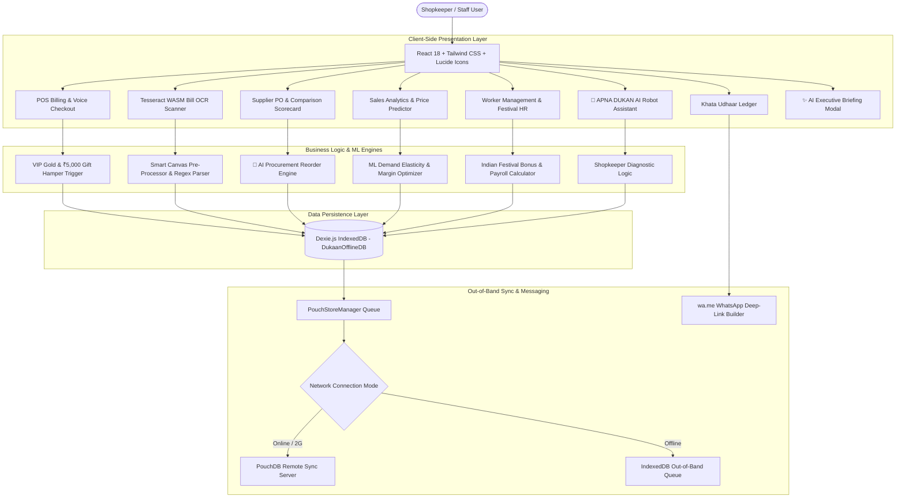

# 🏬 APNA DUKAN - Smart Retail & Shopkeeper Management OS
## Comprehensive Technical Project Documentation & Architecture Guide

---

## 📌 Executive Summary

**APNA DUKAN** is a state-of-the-art, **local-first Indian Retail Management OS** designed specifically for micro-shopkeepers (*Kirana Stores*) in India. Built with zero cloud dependencies, it operates 100% offline using client-side **Dexie IndexedDB** storage, in-browser **Tesseract WASM OCR**, voice-guided checkout (`hi-IN` / `en-IN`), Indian Festival Worker Payroll & HR, Smart Price Elasticity ML Predictors, and an autonomous **AI Procurement Assistant**.

For **HACQUIRE 2026**, the system is structured into **9 isolated, standalone tradable software assets** (`/modules/*`) ready for instant team acquisition on the live trading floor.

---

## 📐 System Architecture & Data Flow



---

## 🛠️ Key Technical Components & Implementation Mechanics

### 1. 📴 Local-First Database Architecture (`Dexie.js` + `PouchStoreManager`)
- **File Location**: [`src/db/pouchStore.ts`](https://github.com/Suvrodipto/apna-dukan/tree/main/src/db/pouchStore.ts)
- **Implementation**:
  - Extends `Dexie` to create `DukaanOfflineDB` storing 10 IndexedDB tables (`products`, `customers`, `ledger`, `purchaseOrders`, `bills`, `suppliers`, `workers`, `salaryRecords`, `festivals`, `workerNotifications`).
  - Implements `PouchStoreManager` singleton supporting live network simulation: **Online**, **Low-Bandwidth (2G)**, and **Offline**.
  - All read/write operations execute synchronously against IndexedDB with zero network latency. If offline, mutations queue automatically and flush upon network reconnection.

---

### 2. 📄 Client-Side Bill OCR Scanner & Price History Engine
- **File Location**: [`src/components/ocr/BillOCRScanner.tsx`](https://github.com/Suvrodipto/apna-dukan/tree/main/src/components/ocr/BillOCRScanner.tsx) & [`/modules/bill-ocr/`](https://github.com/Suvrodipto/apna-dukan/tree/main/modules/bill-ocr)
- **Implementation**:
  - Uses **Tesseract WASM (`tesseract.js`)** to parse receipt images directly inside the browser with **zero cloud API costs**.
  - **Canvas Pre-Processor**: Applies adaptive thresholding, grayscale conversion, and contrast enhancement onto an offscreen `<canvas>` before optical recognition.
  - **Regex Tabular Parser**: Identifies line items, quantities, rates, subtotal, 5% GST, and grand total.
  - **Supplier Price History Modal 📈**: Displays historical scanned prices vs current prices with inflation percentage alerts (*e.g., Atta 5kg ₹195 ➔ ₹210 (+7.7%)*).
  - **✨ AI Insights Card**: Summarizes total scanned purchase (`₹1,942.50`), items added, supplier price surges (`+₹85`), highest value item, and estimated profit margin (`18.4%`).

---

### 3. 📖 Khata Credit & Udhaar Ledger Engine
- **File Location**: [`src/components/khata/KhataLedger.tsx`](https://github.com/Suvrodipto/apna-dukan/tree/main/src/components/khata/KhataLedger.tsx) & [`/modules/khata-ledger/`](https://github.com/Suvrodipto/apna-dukan/tree/main/modules/khata-ledger)
- **Implementation**:
  - Manages double-entry balances (**Jama** credit vs **Udhaar** debit) across 16+ Kirana store customer profiles.
  - **Automated Credit Risk Classifier**: Assigns **Low Risk**, **Medium Risk**, or **High Risk** based on overdue days and debt-to-credit-limit ratios.
  - **WhatsApp Deep-Link Protocol**: Generates zero-cost `wa.me` payment collection reminder links formatted with customer name, exact balance due, and UPI payment options.

---

### 4. 📈 Smart Price & Profit ML Predictor Engine
- **File Location**: [`src/components/analytics/SmartPricePredictor.tsx`](https://github.com/Suvrodipto/apna-dukan/tree/main/src/components/analytics/SmartPricePredictor.tsx) & [`/modules/price-predictor/`](https://github.com/Suvrodipto/apna-dukan/tree/main/modules/price-predictor)
- **Implementation**:
  - Calculates demand elasticity based on inventory turn rate, stock velocity, and margin thresholds.
  - **Low Margin Protection**: Automatically identifies items under 15% gross margin and calculates safe price revisions to achieve 20%+ target margin.
  - **Interactive Aggressiveness Slider**: Custom price multiplier (`1.0x` to `1.5x`) allowing shopkeepers to simulate conservative vs aggressive profit growth.

---

### 5. 👷 Worker Management & Indian Festival Payroll Engine
- **File Location**: [`src/components/workers/WorkerManagement.tsx`](https://github.com/Suvrodipto/apna-dukan/tree/main/src/components/workers/WorkerManagement.tsx) & [`/modules/worker-management/`](https://github.com/Suvrodipto/apna-dukan/tree/main/modules/worker-management)
- **Implementation**:
  - Auto-generates unique Employee IDs (`EMP-101`, `EMP-102`), tracks monthly base salaries, bonuses, and payment statuses (**Paid** via UPI vs **Pending**).
  - **Interactive Indian Festival Calendar**: Supports major festivals (Diwali, Raksha Bandhan, Durga Puja, Eid, Holi, Christmas, Independence Day).
  - **Manual Bonus Configuration**: Supports per-festival **Fixed (₹)** amounts (*e.g., ₹400, ₹500, ₹800, ₹1000*) or **Percentage (%)** calculations with quick chip selectors.
  - **Automated Countdown Alerts**: 14-day and 7-day notification triggers alerting shopkeepers of upcoming bonus payout estimates.

---

### 6. 🚚 Supplier Purchase Order Workflow & Performance Scorecard
- **File Location**: [`src/components/supplier/SupplierOrders.tsx`](https://github.com/Suvrodipto/apna-dukan/tree/main/src/components/supplier/SupplierOrders.tsx) & [`/modules/smart-inventory/`](https://github.com/Suvrodipto/apna-dukan/tree/main/modules/smart-inventory)
- **Implementation**:
  - **🤖 AI Procurement Assistant Card**: Prominently alerts stock-out predictions (*e.g., "⚠️ Amul Taaza Milk predicted to run out in 2 days. Recommended order: 40 units from Amul Dairy Distributors. Savings: ₹320"*). Includes 1-Click **Accept Recommendation** and **Modify Order** controls.
  - **📊 Supplier Comparison Scorecard**: Side-by-side vendor matrix evaluating **⭐ Reliability Score (%)**, **🚚 Avg Delivery Time (Days)**, **💰 Price Competitiveness (Best/Good/Average)**, **📦 Order Fulfillment Rate (%)**, and highlighting the **`✨ AI Recommended`** supplier.

---

### 7. 📊 Interactive Visual Graphs & Charts (Pure SVG Implementation)
- **File Location**: [`src/components/analytics/SalesAnalytics.tsx`](https://github.com/Suvrodipto/apna-dukan/tree/main/src/components/analytics/SalesAnalytics.tsx)
- **Implementation Details**:
  - Built using **pure SVG & CSS without heavy external charting libraries** to ensure zero-latency client rendering, zero bundle bloat, and 100% offline compatibility!
  - **Weekly Sales Trend Line Chart**: Rendered using `<svg viewBox="0 0 500 180">` with dynamic `<polyline>` coordinates, linear gradient fills (`<defs><linearGradient>`), and animated data point circles.
  - **Category Revenue Share Pie Chart**: Rendered using SVG stroke-dasharray circles calculating exact category percentage angles.
  - **🧠 AI Business Health Score Card**: Displays an 82/100 diagnostic score bar (`Business is growing`, `Sales +18.4%`, `₹5,430 credit outstanding`, `3 items need reorder`).

```tsx
/* Example SVG Polyline Line Graph Implementation in SalesAnalytics.tsx */
<svg className="w-full h-44 overflow-visible" viewBox="0 0 500 180">
  <defs>
    <linearGradient id="salesGrad" x1="0" y1="0" x2="0" y2="1">
      <stop offset="0%" stopColor="#f59e0b" stopOpacity="0.4" />
      <stop offset="100%" stopColor="#f59e0b" stopOpacity="0.0" />
    </linearGradient>
  </defs>

  {/* Fill Area */}
  <polygon points="0,180 0,130 80,100 160,115 240,65 320,80 400,35 500,20 500,180" fill="url(#salesGrad)" />

  {/* Trend Polyline */}
  <polyline
    fill="none"
    stroke="#f59e0b"
    strokeWidth="3"
    strokeLinecap="round"
    points="0,130 80,100 160,115 240,65 320,80 400,35 500,20"
  />

  {/* Data Points */}
  <circle cx="400" cy="35" r="5" fill="#f59e0b" className="animate-ping" />
  <circle cx="400" cy="35" r="5" fill="#fbbf24" />
</svg>
```

---

### 8. 🤖 APNA DUKAN AI Assistant & Executive Briefing Modal
- **File Location**: [`src/components/pos/AIPitchSimulationModal.tsx`](https://github.com/Suvrodipto/apna-dukan/tree/main/src/components/pos/AIPitchSimulationModal.tsx) & [`src/components/chatbot/DukaanChatbot.tsx`](https://github.com/Suvrodipto/apna-dukan/tree/main/src/components/chatbot/DukaanChatbot.tsx)
- **Implementation**:
  - **✨ SHOW AI IN ACTION Button**: Opens the Executive Briefing featuring:
    - 🔴 **Important**: *Ramesh has ₹2,000 outstanding for 28 days.*
    - 🟡 **Opportunity**: *Milk sales increased by 34% this week. Consider ordering 20 extra units.*
    - 🟢 **Good News**: *Your revenue is 18.4% higher than last week.*
    - 💡 **Recommendation**: *Reduce stock of slow-moving products to free up ₹3,200 in capital.*
  - **6-Step Animated Pitch Simulator**: Runs a 60-second live demonstration simulating POS streaming ➔ stock decrement ➔ pattern recognition ➔ stock-out alert ➔ AI offer creation ➔ autonomous PO restock.
  - **Robot AI Mascot Chatbot**: Floating advisor widget styled with robot badges, high-tech header icons, and quick-action prompt chips.

---

### 9. 🛍️ Dukan VIP Gold Loyalty & ₹5,000+ Gift Hamper Trigger
- **File Location**: [`src/components/pos/POSBilling.tsx`](https://github.com/Suvrodipto/apna-dukan/tree/main/src/components/pos/POSBilling.tsx) & [`src/db/mockData.ts`](https://github.com/Suvrodipto/apna-dukan/tree/main/src/db/mockData.ts)
- **Implementation**:
  - High-value inventory catalogue items (Organic Kashmiri Saffron ₹1,950, Royal Dry Fruits ₹2,250, Desi Cow Ghee 5L ₹3,850, Basmati Rice 25kg ₹2,850).
  - When customer transaction total exceeds **₹5,000**, the system automatically triggers a celebratory modal awarding a **✨ Complimentary Festive Gift Hamper** and promotes the customer to **VIP Gold Loyalty Status** (5% Extra Discount).

---

## 🏆 HACQUIRE 2026 - Standalone Tradable Asset Suite (`/modules/*`)

All 9 software modules are completely separable with zero cross-module coupling, individual `README.md`, `types.ts`, `index.ts`, `package.json`, and `.env.example`:

| # | Tradable Asset Module | Category | Asking Price (₹ Cr FED Coins) | Standalone Module GitHub Link |
| :-: | :--- | :--- | :-: | :--- |
| **1** | **🌐 Universal Low-Connectivity Sync Layer** *(Flagship)* | Offline Sync | **₹4.80 Cr** | [`/modules/low-connectivity-sync`](https://github.com/Suvrodipto/apna-dukan/tree/main/modules/low-connectivity-sync) |
| **2** | **📄 Client-Side Bill & Document OCR Component** *(Flagship)* | Computer Vision | **₹4.50 Cr** | [`/modules/bill-ocr`](https://github.com/Suvrodipto/apna-dukan/tree/main/modules/bill-ocr) |
| **3** | **👷 Worker Management & Festival Payroll Engine** | HR & Payroll | **₹4.25 Cr** | [`/modules/worker-management`](https://github.com/Suvrodipto/apna-dukan/tree/main/modules/worker-management) |
| **4** | **🎯 Smart Price & Profit ML Predictor Engine** | ML Analytics | **₹4.00 Cr** | [`/modules/price-predictor`](https://github.com/Suvrodipto/apna-dukan/tree/main/modules/price-predictor) |
| **5** | **📈 Sales Analytics & Business Health Engine** | Analytics | **₹4.00 Cr** | [`/modules/sales-analytics`](https://github.com/Suvrodipto/apna-dukan/tree/main/modules/sales-analytics) |
| **6** | **📖 Khata Credit & Udhaar Ledger Engine** | Ledger | **₹3.90 Cr** | [`/modules/khata-ledger`](https://github.com/Suvrodipto/apna-dukan/tree/main/modules/khata-ledger) |
| **7** | **📦 Smart Inventory & Emergency Restock Engine** | Inventory | **₹3.80 Cr** | [`/modules/smart-inventory`](https://github.com/Suvrodipto/apna-dukan/tree/main/modules/smart-inventory) |
| **8** | **💬 WhatsApp Reminders & Notification Engine** | Messaging | **₹3.75 Cr** | [`/modules/whatsapp-reminders-notifications`](https://github.com/Suvrodipto/apna-dukan/tree/main/modules/whatsapp-reminders-notifications) |
| **9** | **📊 Executive Dashboard & Business Analytics** | Analytics | **₹3.60 Cr** | [`/modules/dashboard-analytics`](https://github.com/Suvrodipto/apna-dukan/tree/main/modules/dashboard-analytics) |

---

## 🚀 Setup & Execution Instructions

```bash
# 1. Clone repository
git clone https://github.com/Suvrodipto/apna-dukan.git
cd apna-dukan

# 2. Install dependencies
npm install

# 3. Launch local dev server
npm run dev

# 4. Build production bundle (0 errors guaranteed)
npm run build
```

---

## 📄 License & Hackathon Notice
Developed for **HACQUIRE 2026 (FED, KIIT)**. All standalone modules are licensed for team trading under MIT standards.
